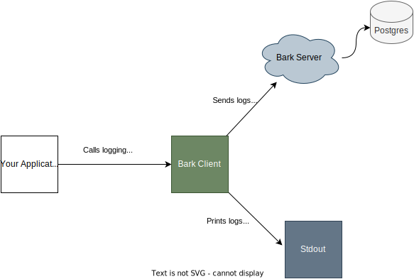

# Bark Client

## IMPORTANT: It is not Yet Built

## What does the client do? 
The Bark client (just _client_ henceforth) is the _library_ side of the bark. It is the piece that takes in the logs from any golang program and sends it to the server which is configured against the client. It is supposed to have the utility functions to help users log to bark directly from go code without having to worry about network calls and such.

## Levels of Logs
The client defines 7 levels of logs:

1. **Panic (P)** - The message you emit right before the program crashes
2. **Alert (A)** - The message needs to be sent as an alert to someone who must resolve it ASAP
3. **Error (E)** - The message indicating that there was an error and should be checked whenever possible
4. **Warning (W)** - The message indicating that something wrong could have happened but was handled. Can be overlooked in some cases.
5. **Notice (N)** - Something worth noticing, though it is fine to be ignored.
6. **Info (I)** - Just a log of some data - does not indicate any error
7. **Debug (D)** - used for debugging. It can represent any level of information but is only supposed to indicate a message emitted during a debug session

Any single character in the place of error level in a parsable single log message would indicate the level of **INFO**. 

## Printing logs via standard output

Bark client is a tool that allows you to send logs to bark server and print them to standard output simultaneously. You can use any of the log methods available in bark client to do this.



If you want to print the logs to a different output, such as a file, you can use the `WithCustomOut` method. This method takes an `io.Writer` parameter and sets it as the output writer for the bark client. For example, if you want to print the logs to a file named random.txt, you can do this:
```
barkClient := client.NewClient("<bark_server_url>", "<custom_log_level>", "<service_name>", "<session_name>")

file, _ := os.Create("random.txt")

logClient.WithCustomOut(file)

barkClient.Info("Some Message that'll be send to random.txt file")
```

### Slog

Bark client uses [slog](https://go.dev/blog/slog) internally to handle the printing of the logs. Slog is a simple and structured logging library for Go.

You can customize how slog prints the logs by specifying a [handler](https://pkg.go.dev/log/slog#Handler). A handler is a function that takes a log record and writes it to an output. Slog provides some built-in handlers, such as [JSONHandler](https://pkg.go.dev/log/slog#JSONHandler) and [TextHandler](https://pkg.go.dev/log/slog#TextHandler), or you can write your own.

**_Note:_** Changing the handler will only affect how the logs are printed, not how they are sent to bark server.

To specify a handler for the bark client, you can use the `WithSlogHandler` method. This method takes a `handler` function as a parameter and sets it as the handler for the slog logger. For example, if you want to use the `JSONHandler` and print the logs as JSON objects to a file named `random.txt`, you can do this:
```
barkClient := client.NewClient("<bark_server_url>", "<custom_log_level>", "<service_name>", "<session_name>")

file, _ := os.Create("random.txt")

logClient.WithSlogHandler(slog.NewJSONHandler(file, barkslogger.Options()))

barkClient.Info("Some Message that'll be send to random.txt file")
```
You may have noticed that we are passing some options to the `JSONHandler` using the `barkslogger.Options()` method. This is because slog has predefined labels for only four log levels: `info, warning, debug, and error`. However, bark client supports three additional log levels: `alert, panic, and notice`. The options returned by `barkslogger.Options()` define labels for these additional log levels.

If you add a nil options, the log labels will appear as described in the [slog documentation here](https://pkg.go.dev/log/slog#Level.String)

 [Slog treats log levels](https://pkg.go.dev/log/slog#Level) as integers. The predefined log levels have the following values:

> LevelDebug Level = -4 \
LevelInfo  Level = 0 \
LevelWarn  Level = 4 \
LevelError Level = 8 \

The custom log levels defined by bark client have the following values:

```
Notice = 1
Alert = 9
Panic = 10
```
If you are writing a custom handler for slog, please make sure to handle these log levels appropriately.